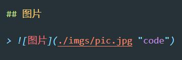

# Markdown 语法（一级标题）

## 标题（二级标题）

> ### 三级标题
>
> #### 四级标题
>
> ##### 五级标题
>
> ###### 六级标题

---

## 段落

> 段落 1（两个以上空格+回车）  
> 段落 2（或者直接一个空行）

---

## 字体 & 中划线 & 下划线

> _斜体 ( \_换用 \* 也可)_
>
> **粗体 (\*换用 \_ 也可))**
>
> **_粗斜体 （同上）_**
>
> ~~中划线~~
>
> <u>下划线</u>

---

## 分隔线

> 三个以上的 \* - \_ 都可

---

## 列表

> 无序( - 可以用 + 或 \* 替换)
>
> - a
> - b
>   - c
>     - d

> 有序（数字 + **\.** + 空格即可，不一定需要按序叠加）
>
> 1. 第一条
> 1. 第二条
> 1. 第三条

---

## 区块

> 这是一个单行区块

> 也可以  
> 多行成块
>
> > 同样也可以嵌套

---

## 代码

> 内容中引用代码， 如像`func()`这样

> 代码片段
>
> ```javascript
> console.log("hellow, world.");
> ```

---

## 链接

> [链接名称](https://github.com/immitut/docs "git地址") 或 <https://github.com/immitut/docs>
> 其中 `"git地址"` 为标题，可省略  
> 也可以嵌套引用
> [git][url], 其中 url 作为地址变量一般放在文档结尾处

---

## 图片

> 

> 同理也可嵌套引用  
> ![图片][imgurl]

> 利用``标签可以进一步控制宽高  
> 

---

## 表格

> | 表头 1 左对齐 | 表头 2 居中 | 表头 3 右对齐 |
> | ------------: | :---------: | :------------ |
> |        内容 1 |   内容 2    | 内容 3        |

---

## 脚注（非标准）

正常文本 [^注明文本]

[^注明文本]: 解释说明文本

---

[url]: https://github.com/immitut/docs "git地址"
[imgurl]: ./imgs/pic.jpg "code"
